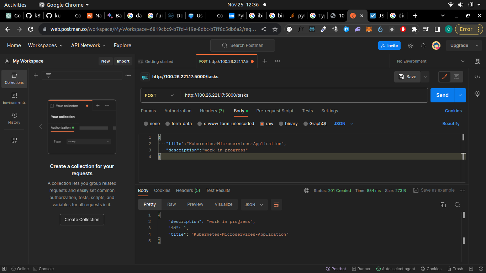

# Deploying Stateless Microservices: Introduction
In your development server, start by installing:
pip3: The official package manager and pip command for Python 3.
virtualenvwrapper: A set of extensions for creating and deleting
Python virtual development environments..
`sudo apt-get upate && apt-get install -y python3-pip `
`pip install virtualenvwrapper`
`export WORKON_HOME=~/Envs`
`mkdir -p $WORKON_HOME`
`export VIRTUALENVWRAPPER_PYTHON='/usr/bin/python3'`
`source ~/.local/bin/virtualenvwrapper.sh`
Let’s create a new virtual environment:
`mkvirtualenv stateless-flask` 
error:
**virtualenvwrapper.sh: command not found**
fix by reinstalling virtualenv
`sudo apt install virtualenv`

Then create the folders for our Flask application and install its dependencies.
1 mkdir -p stateless-flask
2 cd stateless-flask
3 mkdir -p app
4 mkdir -p kubernete
5 pip install Flask==2.2.3
6 pip freeze > app/requirements.txt

The python code, create a simple todo application:
Next, we are going to create a Dockerfile:

We can now build the image and run it to test it.
1 `docker build -t stateless-flask:v0 -f app/Dockerfile app`
2 `docker run -it -p 5000:5000 stateless-flask:v0`

Since we are exposing the container on port 5000 of the host, we will query
the Flask-generated API by using a tool like Postman, the public IP of our
droplet followed by port 5000.

Don’t forget to add the header Content-Type and make it accept JSON by
giving it the value application/json.

After saving the first element, you can execute a GET request on /tasks,
you will get the same JSON data you stored. However, when stopping the
container, the data will be erased, which is normal since the application is
stateless and does not store in any external datastore.

#### Pushing docker image to dockerhub
1 `docker login`
2 `docker tag stateless-flask:v0 <dockerhub_username>/stateless-flask:v0`
3 `docker push <dockerhub_username>/stateless-flask:v0`

### Creating a Namespace
We are going to deploy the Flask API in a Namespace different from the default one.
check `kubernetes/namspace.yml`

Now, apply the YAML.
`kubectl apply -f kubernetes/namespace.yml`

Print a list of all Namespaces:
`kubectl get ns`

### Creating the Deployment
To deploy our Flask container, we need to create a Deployment. The
Deployment will create a ReplicaSet and the latter is responsible of
maintaining a stable set of replica Pods.
check `kubernetes/deployment,yml`

We can apply the YAML file and get the list of Deployments in “stateless-
flask” Namespace. Again, make sure to change <your-docker-registry>
by your Docker Hub username.

1 `kubectl apply -f kubernetes/deployment.yaml`
2 `kubectl get pods -n stateless-flask`

Note that our cluster has one node. If we had two, the 3 Pods we created
will most likely be distributed across nodes.

### Examining Pods and Deployments
A useful command we can use to check the status, events, and configuration
of the Pod us kubectl describe
If you used Docker, you are certainly familiar with the docker inspect
<container> command. The kubectl describe pod <pod> command, is
somehow similar.

`kubectl -n stateless-namespace describe pod pod-name`

You can also describe the Deployment using:
`kubectl -n stateless-flask describe deployment <deployment>`

Events provide a way to monitor the state of different objects within the
system. These objects could be nodes, pods, deployments, services, and so
on. They provide an audit trail of changes that occur to these objects over
time.

Pods’ logs are another way to understand what’s happening inside a Pod.
Using the following command, we can see the logs of a Pod:

`kubectl -n stateless-flask logs <pod>`

If you want to get the logs of all pods in a single command, you can do it by
filtering by the label. This is an example:
`kubectl -n stateless-flask logs -l app=stateless-flask`

To show logs and follow the changes, you can add the -f flag.
1 `kubectl -n stateless-flask logs <pod> -f`
2 `kubectl -n stateless-flask logs -l app=stateless-flask -f`

### Accessing Pods
A Pod does not explore any external address/port, therefore, if we want to
see the Flask application running, we need to forward the internal Pod port
to one of the ports in our development server. This is how to do it:
`kubectl port-forward statesless-flask-776bc5d8b6-646xj 5000:5000 -n stateless-namespace`

You can also use AWK to get the first pod that appears on the list when you
type kubectl get pods as follows:
`export pod=$(kubectl get pods -n stateless-flask | awk 'FNR==2{print $1 }' )`

`kubectl port-forward $pod 5000:5000 -n stateless-flask`

In both cases, the Pod is now accessible via our local server, we can check
its response using:
`curl http://0.0.0.0:5000/tasks`

#### Exposing a Deployment
If we want to use our Flask application in a regular way, we should make it
accessible via a web browser. However, there is no external access to our
Pod, unless we create a port forwarding. This is why we need to create a
Service.

In Kubernetes, there are several ways to expose an application on the network, including ClusterIP, NodePort, LoadBalancer, Ingress, and Headless services.

### ClusterIP Service
ClusterIP is the default Service type that provides a stable IP address to
reach the service within the cluster. It exposes the Pods in a cluster to other
objects in the same cluster using an internal IP address, allowing for seamless communication between components.

ClusterIP service is used to enable communication between different components or microservices within a Kubernetes cluster. It acts as a **virtual IP** address assigned to a set of Pods

Apply the YAML file and check the list of Services:
`kubectl apply -f kubernetes/clusterip-svc.ym`
`kubectl get svc -n stateless-flask`

Now, we can test the connection to the service using a cURL command.
` kubectl exec -it statesless-flask-776bc5d8b6-646xj /bin/bash -n stateless-namespace`

### NodePort Service
NodePort is a service that exposes a deployment externally on a static port
on each node in the cluster. The port range for NodePort services is 30000-
32767, which allows external traffic to reach the service on the specified
port, which is then forwarded to the Pod.
One of the advantages of NodePort is simplicity, as it doesn’t require any
external load balancers or network components. It’s also easy to use and
doesn’t require much configuration.
However, there are some drawbacks to using NodePort. It exposes the
service on a static port on every node in the cluster, which can cause
security problems if you have potential security problems. It also requires
opening up a port range on all nodes in the cluster, which can be a potential
attack vector.
NodePort can be useful for testing and debugging purposes, however, if you
have a production workload and you want to allow external traffic, it is not
the most suitable solution.

check `deployment/nodeport-service.yaml`
The ports that this service will listen on are defined in ports, including
port (the port that the service listens on), protocol (the protocol used by
the port), targetPort (the port on the pod that traffic should be sent to),
and nodePort (the port that the service is exposed on each node in the
cluster). In this case, the service listens on port 5000 and is exposed on each
node in the cluster on port 30000 .

Now you can apply that YAML:

`kubectl apply -f kubernetes/nodeport-service.yaml`

List the services:
`kubectl get svc -n stateless-flask`

Get the external IP address of any of your cluster nodes:
`kubectl get nodes -o wide`

Using your web browser, a tool like Postman or cURL, you can check the
response of the API using the external IP of the node and port 30000
`curl http://<internal_ip>:30000/tasks`
NOTE: Minikube doesnt support external ip

 If you want to do it all in a single command, you can use:
`curl HTTP://$(kubectl get nodes -o wide | awk '{print $7}' | tail -n +2 ):30000/tasks`

kubectl get nodes -o wide | awk '{print $7}' | tail -n +2 will
get the external IP address without showing all the output of kubectl get
nodes -o wide.

### LoadBalancer Service 
LoadBalancer is another type of service available for use in a Kubernetes
cluster. It helps distribute incoming traffic to multiple replicas of a Pod. It is
an implementation of the Load Balancing pattern, which is used to
distribute traffic across multiple nodes, services, or systems.
In Kubernetes, things are a little bit different: To implement this pattern,
you will need two things:
A LoadBalancer service
A load balancer machine
While the service is a Kubernetes object that is part of the cluster, the
machine is external and does not make part of the cluster. If you are
managing a bare-metal Kubernetes or an on-premises cluster, the
implementation could be challenging, however, if you are using a managed
cluster using a public cloud such as AWS, GCP, or DigitalOcean, things are
much easier.
Usually, the cloud provider automatically provisions the load-balancing
machine for you.
A LoadBalancer service can help improve the availability and scalability of
an application by distributing traffic across multiple replicas, which reduces the likelihood of a single point of failure.
One of its important advantages is its ability to automatically detect unhealthy replicas and redirect traffic to healthy ones, which adds another layer of reliability to your workload.
Additionally, when you create a LoadBalancer, you can add advanced features like SSL termination, connection draining, and session affinity.

#### Run the apply command:
`kubectl apply -f kubernetes/loadbalancer-service.yaml`

Watch the list of your services using kubectl get svc -n stateless-
flask -w and when the external IP address of your load balancer machine
is ready, start testing the API using the same IP and the port 5000 ( port).
Let’s test:
`load_balancer_ip = $(kubectl get svc -n stateless-flask | grep "LoadBalancer" | awk '{print $4}')`

`curl http://$load_balancer_ip:5000/tasks`

### Headless Service
Normally, a Kubernetes service has a virtual IP address (ClusterIP) and a
DNS name that resolves to this IP. When a client connects to the service IP,
it is transparently redirected to one of the pods that are backing the service.
What if I want to access each Pod using its own IP address? This is possible with the Headless services feature of Kubernetes.

Headless services are created using the same syntax as regular services but
with the **clusterIP** set to "**None**" .

You can now create the service:
`kubectl apply -f kubernetes/headless-service.yaml`

In order to test the DNS resolution, let’s create a temporary Pod tmp01 that
runs the image **“tutum/dnsutils”.** We are deploying this Pod because it has
dnsutils installed, which is a set of tools that we can use to test DNS resolution.

We will use the nslookup command to test the DNS resolution of the `stateless-flask-headless-service.stateless-namespace.svc.cluster.local` service

Note that the Headless service does not have an IP, however it can be
accessible by its internal DNS name

`stateless-flask-headless-service.stateless-namespace.svc.cluster.local`

Deploy the temporary Pod tmp01 using kubectl:
`kubectl run tmp01 --image=tutum/dnsutils -- sleep infinity`

Use nslookup to test the DNS resolution of the Headless service. We can execute a command from a Pod without being inside it using:
`kubectl exec -it tmp01 --nslookup stateless-flask-headless-service.stateless-namespace.svc.cluster.local`
**output**:
Server: <IP of the DNS server>
Address: <IP of the DNS server>#53
Name: stateless-flask-headless-service.stateless-flask.svc.cluster.local
Address: <IP of the Pod 1>
Name: stateless-flask-headless-service.stateless-flask.svc.cluster.local
Address: <IP of the Pod 2>

Notice how the DNS server returns the IP addresses of the Pods that are
running the stateless-flask application. A ClusterIP will never return the
IP addresses of the Pods, it will only return its own IP address.

Database clustering is a common use case for Headless services.
RabbitMQ, MySQL, and PostgreSQL are examples of applications that can
be clustered using Headless services

Internal names are only accessible from within the cluster. They
use the format <service-name>.<namespace>.svc.cluster.local.
For example, to access the stateless-flask-headless-service
service from another Namespace (different from stateless-flask) we use stateless-flask-headless-service.stateless-
flask.svc.cluster.local where stateless-flask is the Namespace where the service is running, stateless-flask-headless-service is
the name of the service and svc.cluster.local is the domain name of
the cluster.

### Ingress Service
An Ingress is a component that allows inbound connections to the cluster. It
provides a way to manage external access to the services in the cluster.
Instead of creating a separate LoadBalancer service for each service,
Ingress enables you to define a set of rules that route traffic to different
services based on the request’s host or path.
Ingress services simplify access to your services by using a single IP
address and domain names, it is also able to use an SSL/TLS certificate to
encrypt the traffic. It has a flexible configuration that allows you to define
the rules to route the traffic to the services.
For example, I can redirect the traffic to the service my-service when the
request is made to the host myhost.com and the path /my-service. While when the request is made to the host myhost.com and the path /my-other-service the traffic will be redirected to the service my-other-service.
Even if some cloud providers do not support native Ingress services, you can always use an open-source or commercial Ingress controller like
**Traefik** or **Nginx**.

This is a list of some of them:

**Nginx Ingress:** This is one of the most popular controllers, it uses the
Nginx web server to manage Ingress traffic.
**Traefik Ingress:** This controller supports multiple proxy technologies
and offers easy integration with cloud service providers.
**HAProxy Ingress**: This controller uses the HAProxy proxy server to
manage Ingress traffic.
**Istio Ingress:** Istio is a service mesh platform that offers an Ingress
controller with advanced security features such as authentication,authorization, and encryption.
**Contour** Ingress: This controller uses the Envoy proxy server to manage Ingress traffic and offers easy integration with Kubernetes resources.

It is also important to note that routing rules are based on the HTTP(S)
request, so it is not able to route TCP or UDP traffic. If you want to expose
a TCP/UDP port, you will need to use a LoadBalancer or a NodePort

Before creating the Ingress, let’s clean all the previously created services:
`kubectl delete --all svc -n stateless-namespace`

We will need a ClusterIP service in front of our Pods. This service will be used by the Ingress controller to route the traffic to the Pods. Let’s create it:
NOTE: for production based architecture we use LoadBalance service and not ClusterIP

`kubectl apply -f kubernetes/stateless-flask-service.yaml`

Now, let’s create the Ingress resource.

As we have seen there are multiple Ingress controllers available. We will
use the Nginx Ingress controller. This controller is deployed as a Pod in the
cluster.

To install the Nginx Ingress controller, we will use a Helm chart.

Helm is a package manager for Kubernetes. It allows to easily install
applications on kubernetes/cluserip-service.yam

Start by installing Helm on your development server:

`curl https://raw.githubusercontent.com/helm/helm/master/scripts/get-helm-3 | bas`

helm install nginx-ingress ingress-nginx/ingress-nginx --set controller.publishService.enabled=true

helm install nginx-ingress ingress-nginx/ingress-nginx --set controller.publishService.enabled=true